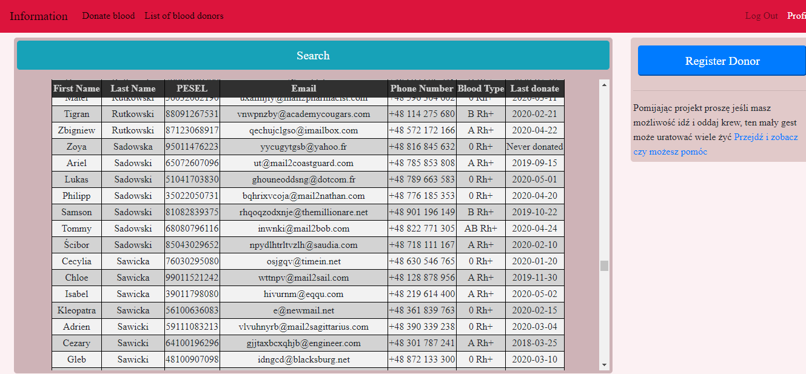
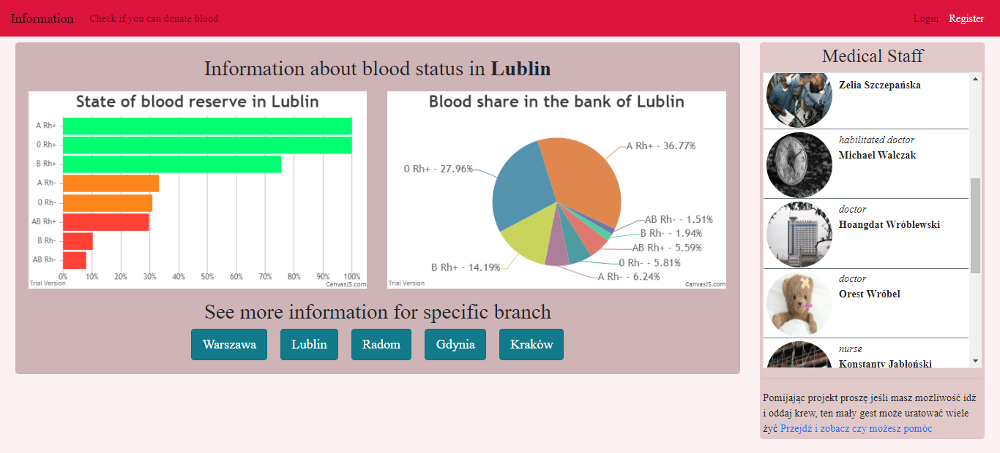
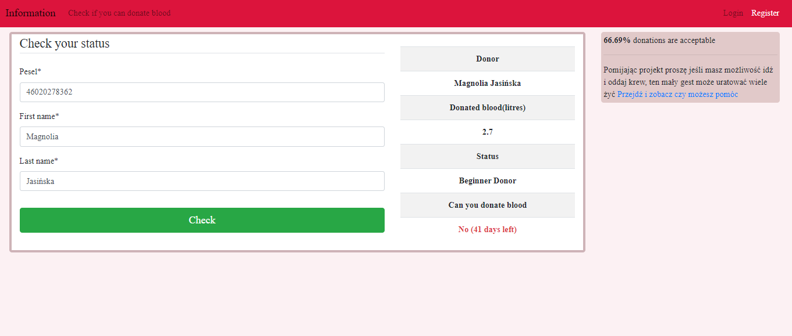
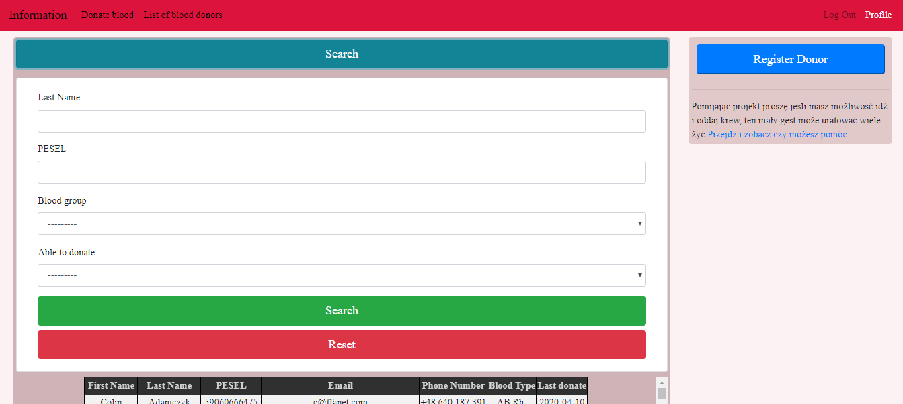
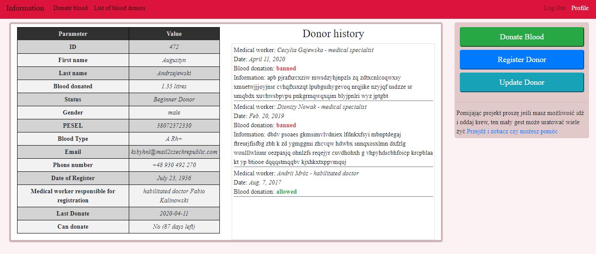

# Blood_donation(https://blood-dontaion.herokuapp.com/)
!!!TESTY
> Web App for managing the blood donor database + REST API (project maybe be offline due to free tier usage limits on AWS, if you want to see it LIVE let me know)


## Table of contents

- [General info](#general-info)
- [Login details](#login-details)
- [Screenshots](#screenshots)
- [Technologies](#technologies)
- [Setup](#setup)
- [Features](#features)
- [Contact](#contact)

## General info

The project aimed to create a Web App enabling the management of blood banks in various departments. Medical staff can
register donors, update them, see their detailed information and blood donation history.
People who are not logged in can check whether they can donate blood and information about the state of blood banks.
The project has a program for creating a logical, unique database.

<b>REST API</b> documentation: [API-guide.md](api/API-guide.md)

## Login details

Login as admin:

- username - admin
- password - admin

Check donor status without login as employee(random examples)

- PESEL: 70040598908, First_name: Marysia, Last_name: Adamczyk
- PESE: 86110262453, First_name: Philip, Last_name: Andrzejewski

All registered donors can be found on admin page( Info › Patients)(https://blood-dontaion.herokuapp.com/admin/)

## Screenshots







## Technologies

- Python - version 3.8.1
- Django - version 3.05
- Django REST framework - version 3.11
- bootstrap - version 4.4.1
- jquery - version 3.4.1
- AWS S3
- HTML5/CSS

## Setup

1. Install Python and pipenv 
2. Run this commends in the project folder
```
    pipenv install -r requirements.txt
    pipenv shell
```
2. Run program [fill_db_blood_donation.py](Assets/fill_db_blood_donation.py) (in Assets folder) and follow instructions there to run project and create your own unique DB

## Features

List of features:

- Fully functional REST API
- optimized queries
- information about the blood base and employees divided into individual departments
- authorization system(login, logout, register, reset password, update) with secret key to prevent unauthorized people to login
- every registered donor can check if they can donate blood
- when donating blood, an employee sees the entire medical history of a donor
- an employee can register a donor, update him/her and has insight into his/her detailed information
- the employee can search for a donor using custom filters
- App tracks donor status through liters of blood donated
- improved security
- added caches
- There are a lot more features like checks if donor is 18+ or create valid PESEL for doonor, please just go throgh code there is all
  the informations

To-do list:

- add application that track blood collection from the blood bank

## Contact

Created by <b>Marek Chałabis</b> email: chalabismarek@gmail.com
